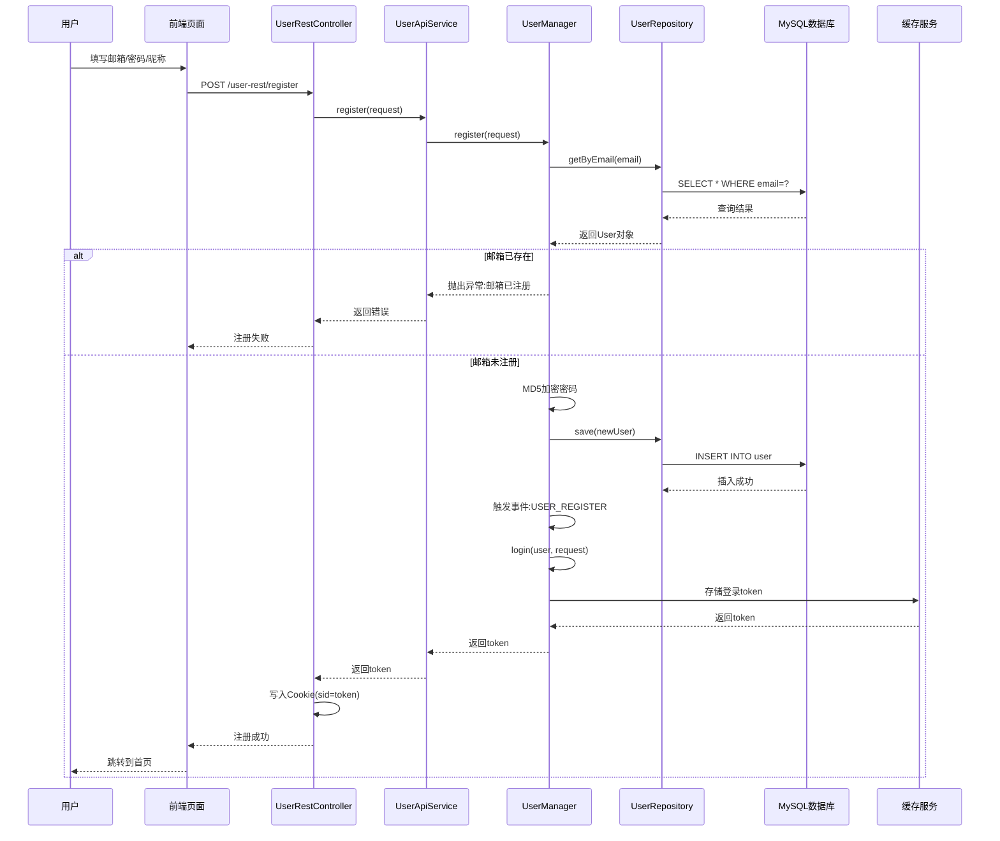
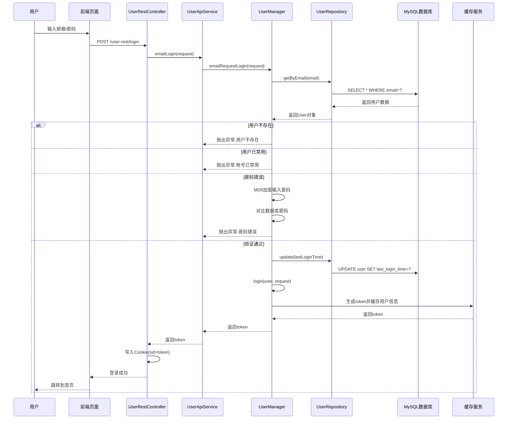
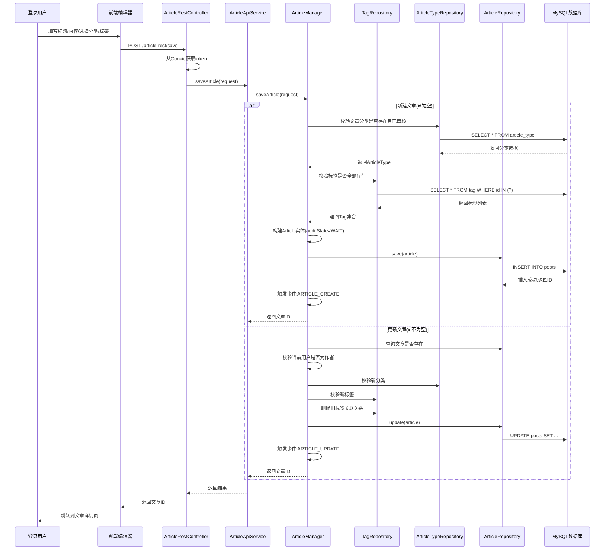
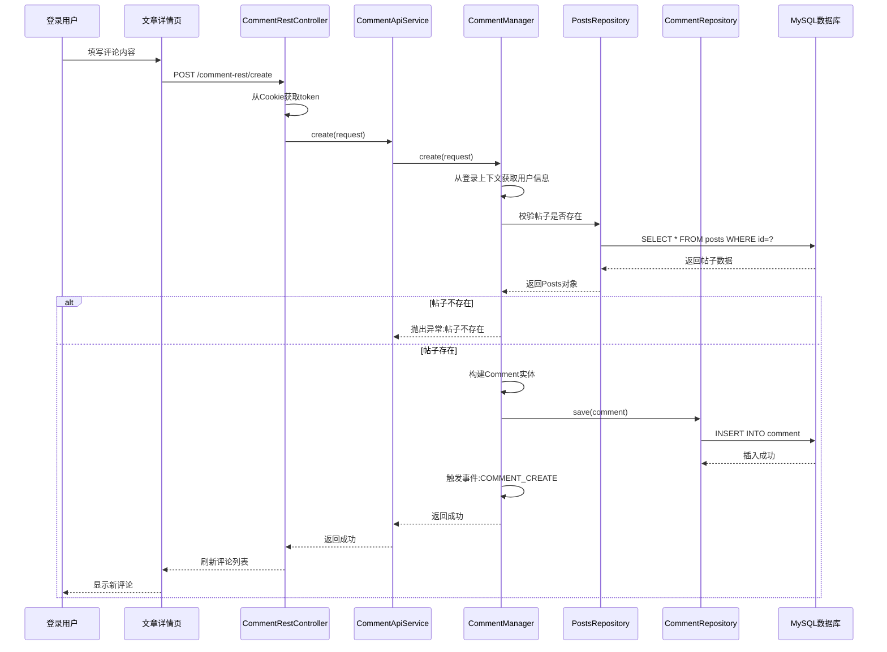
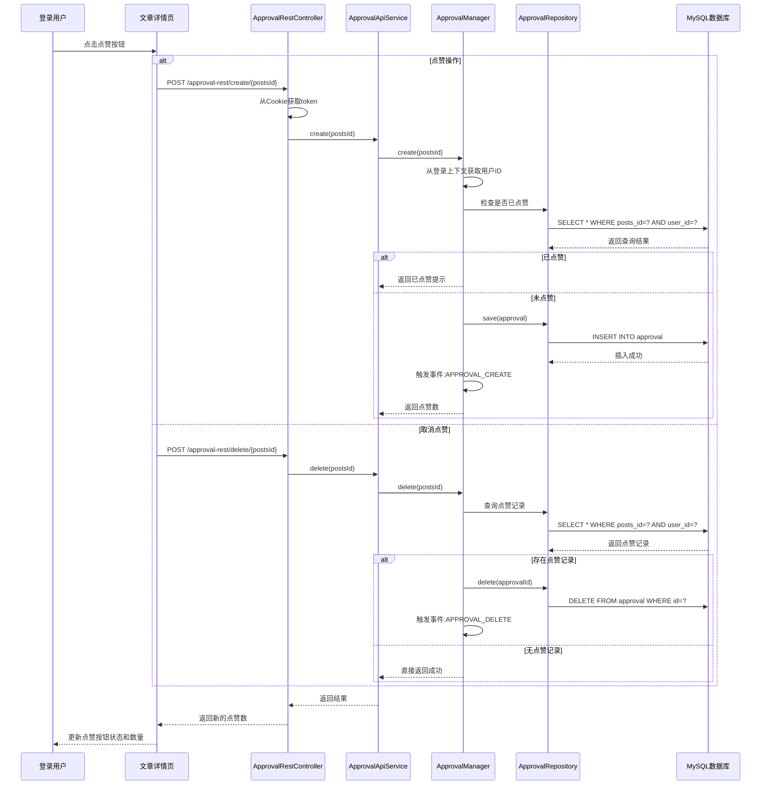

# forum-java 用户核心流程文档

## 1. 用户注册流程

### 流程描述
用户通过邮箱和密码完成账号注册,系统自动完成登录并颁发访问凭证。

### 技术实现路径
```
前端表单 → UserRestController → UserApiService → UserManager → UserRepository → 数据库
```

### 详细步骤



### 关键代码位置
- **Controller**: `forum-portal/src/main/java/pub/developers/forum/portal/controller/rest/UserRestController.java:42`
- **Manager**: `forum-app/src/main/java/pub/developers/forum/app/manager/UserManager.java:148`
- **核心校验**: 邮箱唯一性检查、密码MD5加密
- **事件触发**: `EventBus.emit(EventBus.Topic.USER_REGISTER, registerUser)`

---

## 2. 用户登录流程

### 流程描述
用户使用邮箱和密码登录,验证通过后系统颁发访问凭证并缓存用户信息。

### 技术实现路径
```
前端表单 → UserRestController → UserApiService → UserManager → UserRepository → 数据库/缓存
```

### 详细步骤



### 关键代码位置
- **Controller**: `forum-portal/src/main/java/pub/developers/forum/portal/controller/rest/UserRestController.java:53`
- **Manager**: `forum-app/src/main/java/pub/developers/forum/app/manager/UserManager.java:53`
- **核心校验**: 用户存在性、账号状态、密码MD5校验
- **缓存策略**: token → User对象映射,userId → token映射

---

## 3. 文章/问答发布流程

### 流程描述
登录用户填写标题、内容、选择分类和标签后提交,系统进行审核状态管理并触发相关事件。

### 技术实现路径
```
前端编辑器 → ArticleRestController → ArticleApiService → ArticleManager → ArticleRepository → 数据库
```

### 详细步骤



### 关键代码位置
- **Controller**: `forum-portal/src/main/java/pub/developers/forum/portal/controller/rest/ArticleRestController.java:30`
- **Manager**: `forum-app/src/main/java/pub/developers/forum/app/manager/ArticleManager.java:53`
- **核心校验**: 
  - 分类校验: `forum-app/src/main/java/pub/developers/forum/app/manager/ArticleManager.java:271`
  - 标签校验: 继承自AbstractPostsManager
  - 作者权限校验(更新时): `ArticleManager.java:75`
- **审核机制**: 新建文章默认`auditState=WAIT`,需管理员审核后才能公开展示
- **事件触发**: `ARTICLE_CREATE`、`ARTICLE_UPDATE`

---

## 4. 评论发布流程

### 流程描述
登录用户在文章/问答详情页填写评论内容并提交,系统自动关联到对应帖子。

### 技术实现路径
```
前端评论框 → CommentRestController → CommentApiService → CommentManager → CommentRepository → 数据库
```

### 详细步骤



### 关键代码位置
- **Controller**: `forum-portal/src/main/java/pub/developers/forum/portal/controller/rest/CommentRestController.java:29`
- **核心逻辑**: 继承自AbstractPostsManager的评论管理能力
- **事件触发**: `EventBus.Topic.COMMENT_CREATE`

---

## 5. 点赞功能流程

### 流程描述
登录用户对文章/问答点赞或取消点赞,系统记录点赞关系并更新统计数据。

### 技术实现路径
```
前端点赞按钮 → ApprovalRestController → ApprovalApiService → ApprovalManager → ApprovalRepository → 数据库
```

### 详细步骤



### 关键代码位置
- **Controller**: `forum-portal/src/main/java/pub/developers/forum/portal/controller/rest/ApprovalRestController.java:25`
- **API定义**: `forum-api/src/main/java/pub/developers/forum/api/service/ApprovalApiService.java:12`
- **核心功能**:
  - 创建点赞: `create(postsId)`
  - 取消点赞: `delete(postsId)`
  - 检查点赞状态: `hasApproval(postsId)` (在文章详情页使用)

---

## 架构说明

### 分层架构
```
forum-portal (Controller层) 
    ↓
forum-facade (API实现层/参数校验)
    ↓
forum-app (Manager业务逻辑层)
    ↓
forum-domain (领域实体层)
    ↓
forum-infrastructure (Repository数据访问层)
    ↓
MySQL数据库
```

### 核心技术组件
- **Web框架**: Spring Boot 2.3.3 + Spring MVC
- **持久层**: MyBatis + PageHelper
- **缓存**: CacheService (支持Redis/本地缓存)
- **连接池**: HikariCP
- **JSON处理**: Fastjson 1.2.69
- **模板引擎**: Thymeleaf
- **前端**: Bootstrap + Mavon-Editor

### 认证机制
- **凭证存储**: Cookie中的`sid`字段存储token
- **权限校验**: `@IsLogin`注解 + AOP切面
- **用户上下文**: `LoginUserContext` ThreadLocal存储
- **登录状态**: token → User对象缓存映射

### 事件驱动
系统使用`EventBus`实现异步事件处理:
- `USER_REGISTER`: 用户注册(操作日志、通知管理员)
- `USER_LOGIN`: 用户登录(操作日志)
- `USER_LOGOUT`: 用户登出(操作日志)
- `ARTICLE_CREATE`: 文章创建(统计、通知)
- `ARTICLE_UPDATE`: 文章更新(历史记录)
- `COMMENT_CREATE`: 评论创建(消息通知、统计)
- `APPROVAL_CREATE`: 点赞创建(消息通知)

### 审核机制
内容发布采用审核制:
- **审核状态**: `WAIT`(待审核)、`PASS`(通过)、`REJECT`(拒绝)
- **可见性**: 仅作者本人和管理员可见待审核内容
- **管理员权限**: 可设置置顶、官方、精华等标记
